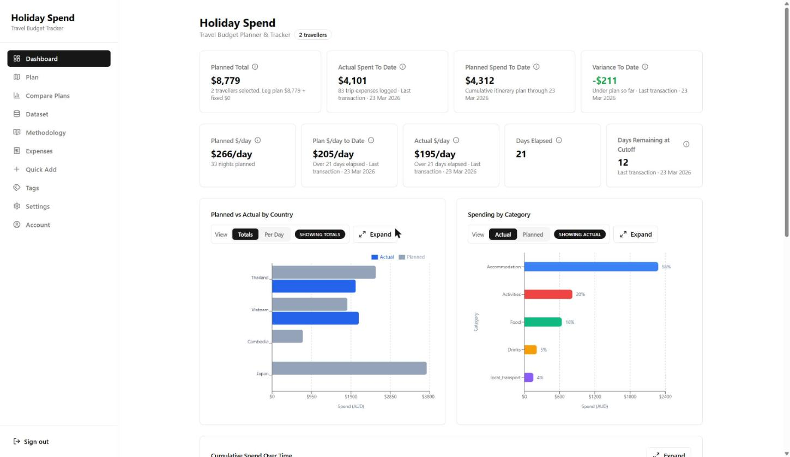
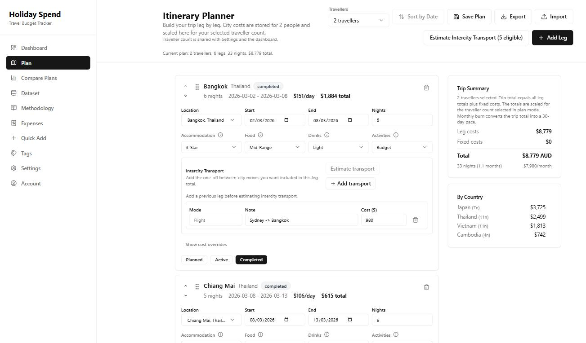
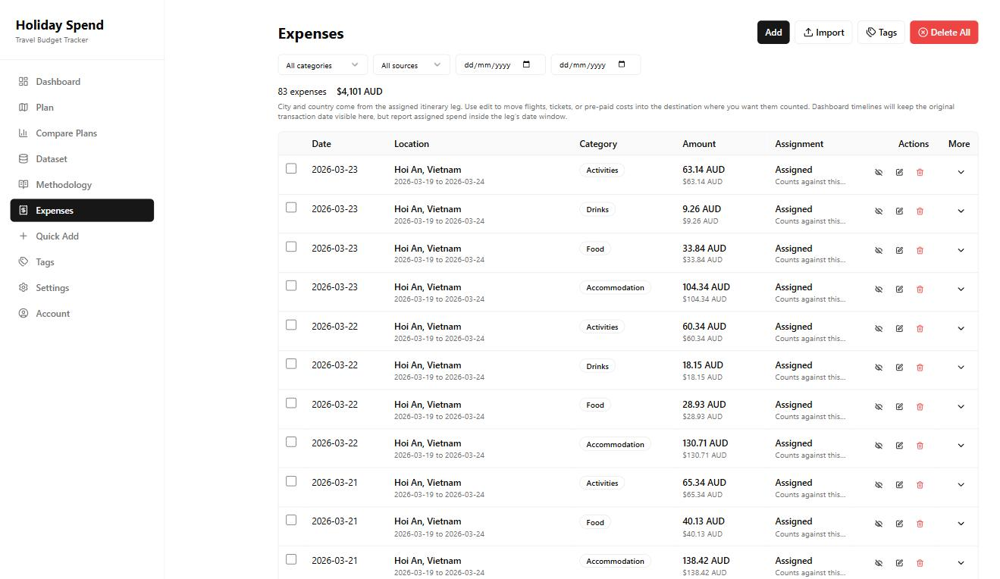
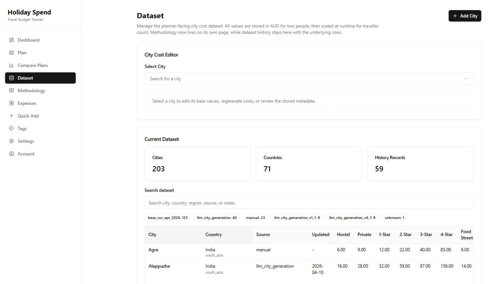

# Holiday Spend

A travel budget planner and spend tracker built for long multi-city trips — the kind where you are away for
months, crossing a dozen countries, and "what will this actually cost?" is genuinely hard to answer.



## The problem

Most budgeting tools assume you are at home with a fixed income and recurring bills. Trip planners assume a
two-week holiday to one place. Neither helps when you are planning eleven months across four continents and need
to know whether staying an extra week in Japan means cutting one in Peru.

Two things make that hard:

1. **Costs vary enormously by city and by how you travel.** A night in Tokyo is not a night in Hanoi, and a
   3-star hotel is not a hostel dorm. You need per-city, per-tier numbers, not a single daily average.
2. **Plans change constantly while you travel.** You need to see how actual spending is tracking against the
   plan, per country and per category, and re-forecast as you go.

Holiday Spend answers both: model the trip city by city before you leave, then track what you actually spend
against it while you are away.

## What it does

### Plan a trip leg by leg

Each leg picks a city, dates, and a tier for accommodation, food, drinks and activities. Costs are stored per
city for two travellers and scaled at runtime for your traveller count, so changing party size re-costs the whole
trip without rewriting any data.



Intercity transport is tracked separately, with optional LLM-backed estimation that returns reviewable options
with sources — nothing is applied to your plan until you choose it.

### Track what you actually spend

Log expenses manually or import Wise CSV exports. Each expense is assigned to an itinerary leg, so spending is
attributed to the right city and country even when you paid for it weeks earlier.



### Compare planned against actual

The dashboard shows variance to date, burn rate per day, and planned-versus-actual broken down by country and
category. Saved plan snapshots can be compared side by side to see how a change to the itinerary moves the total.

### Maintain the city cost library

121 cities ship with the app. Any city not in the library can be generated on demand, and every generated row
records where its numbers came from.



## How the city costs work

This is the part with the most design behind it, so it is worth explaining.

Generating a city's costs uses **one** web-enabled LLM call that returns ten intuitive price anchors in USD — a
hostel bed, a 3-star hotel, a street meal, a beer, and so on — plus the latest dated RBA USD/AUD observation.

The model does no arithmetic. Deterministic server code validates the FX observation, applies fixed formulas to
derive all 19 planner fields from the ten anchors, and converts to AUD. The same inputs always produce the same
output, and the derivation can be re-run and checked.

Every generated row stores its provenance: the anchors, the provider and model, the reasoning effort, the prompt
and formula versions, the FX snapshot with its as-of date, and the model's own confidence notes. The
`/estimates` page documents the methodology in the app itself.

Two principles run through it:

- **Fail closed.** An unsupported value stays missing rather than becoming a plausible substitute.
- **Never present a model estimate as an observed price.** Generated values are labelled as what they are.

## Built with

Next.js 14 (App Router) · TypeScript · Tailwind · Radix/shadcn · SQLite via Drizzle ORM and `better-sqlite3` ·
Zod · Recharts · NextAuth · Vitest and Playwright.

The app is a single Next.js deployment with SQLite on disk — deliberately simple to run and back up for something
one household uses. Provider API keys for LLM generation are entered in the browser and never reach the
repository, server database, or logs.

## Running it locally

```bash
npm ci
cp .env.example .env.local     # then set NEXTAUTH_SECRET and AUTH_DEV_PIN
npm run db:seed                # loads the 121-city cost dataset
```

Then either:

```bash
npm run dev                    # for editing code
npm run build && npm start     # for actually using the app
```

Use the production build when you want to use the app. Development mode serves unminified bundles — roughly
14 MB of JavaScript for the dashboard against 263 kB built — so it is not representative of how the app performs.
The two write to separate build directories (`.next-dev` and `.next`) so they do not invalidate each other.

Sign in with `AUTH_DEV_PIN` in development. Production disables that PIN by design, so it needs an
email/password account — `npm run auth:set-local-password` sets one for the local user.

### Verification

```bash
npx tsc --noEmit
npm run build
npm test -- --run
npm run docs:check-memory          # CLAUDE.md and AGENTS.md must stay identical
npm run methodology:v1.1:check     # deterministic formula, FX and dataset-integrity check
npm run performance:check          # authenticated route, payload and JS-size budgets
```

`performance:check` needs credentials (`WEBAPP_AUTH_EMAIL` and `WEBAPP_AUTH_PASSWORD`, or `WEBAPP_AUTH_PIN` with
`WEBAPP_REQUIRE_BUILD=false` against a dev server). It fails rather than measuring an unauthenticated redirect,
which is a mistake an earlier version of it made for a month.

## Project structure

| Path | Contents |
| --- | --- |
| `src/app` | Routes and API handlers |
| `src/components` | Planner, dashboard, city library and UI components |
| `src/lib` | Cost calculators, import logic, LLM clients, methodology code |
| `src/db` | Schema, runtime bootstrap and seed script |
| `data/reference/` | Canonical datasets and retained methodology evidence |
| `docs/prompts/` | Versioned LLM prompt contracts |
| `scripts/` | Build, validation and reproducibility tooling |

## Documentation

| File | Purpose |
| --- | --- |
| [CLAUDE.md](./CLAUDE.md) / [AGENTS.md](./AGENTS.md) | Project memory — what the app is and how it works today |
| [PLAN.md](./PLAN.md) | Active plan, milestone status, open decisions |
| [LOG.md](./LOG.md) | History — what was built, what was tried, and what the evidence showed |
| [docs/product/transport-estimation.md](./docs/product/transport-estimation.md) | How intercity transport estimation works |
| [docs/ops/deployment.md](./docs/ops/deployment.md) | Deployment |
| [docs/README.md](./docs/README.md) | Guide to everything else under `docs/` |

`LOG.md` is worth a look if you are interested in how decisions were reached. It records approaches that were
tried and rejected alongside the ones that shipped, including a city-cost methodology that took six iterations
before being abandoned in favour of the simpler one now in use.

## A note on scope

This is a personal project built for one household's travel, not a product with sign-ups. The screenshots use
fictional demo data. It is public because the engineering may be of interest, not because it is looking for
users.
