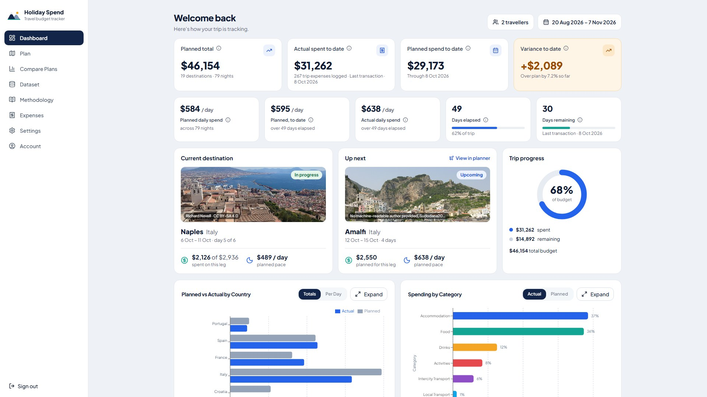
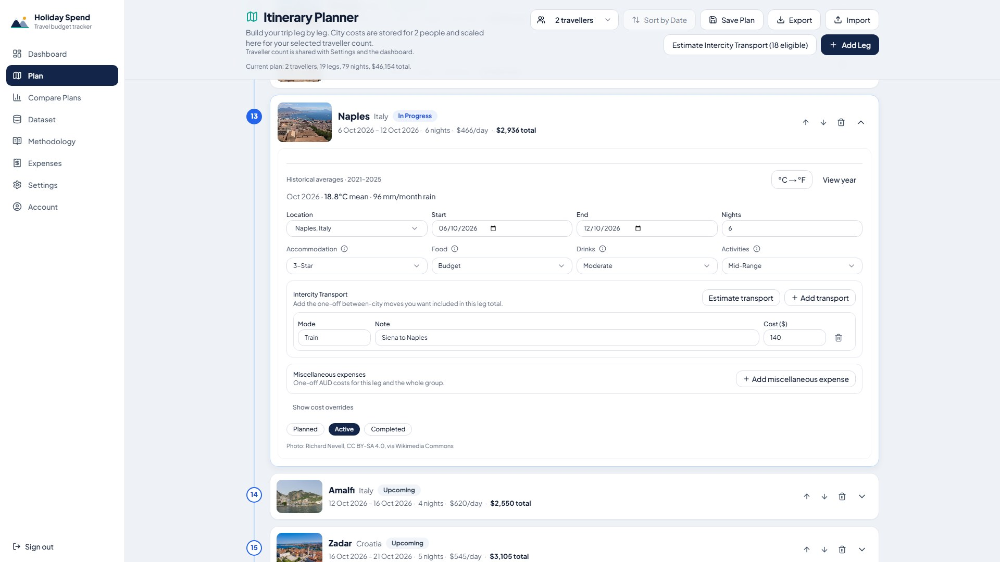
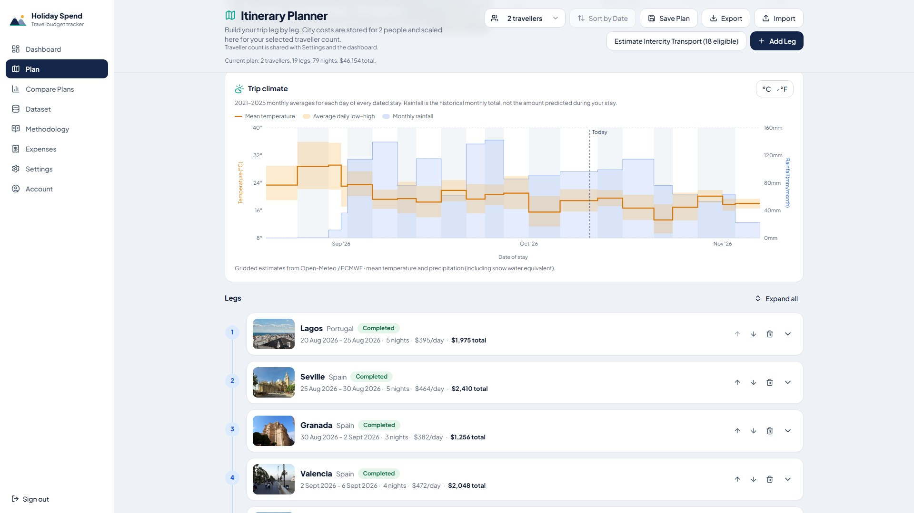
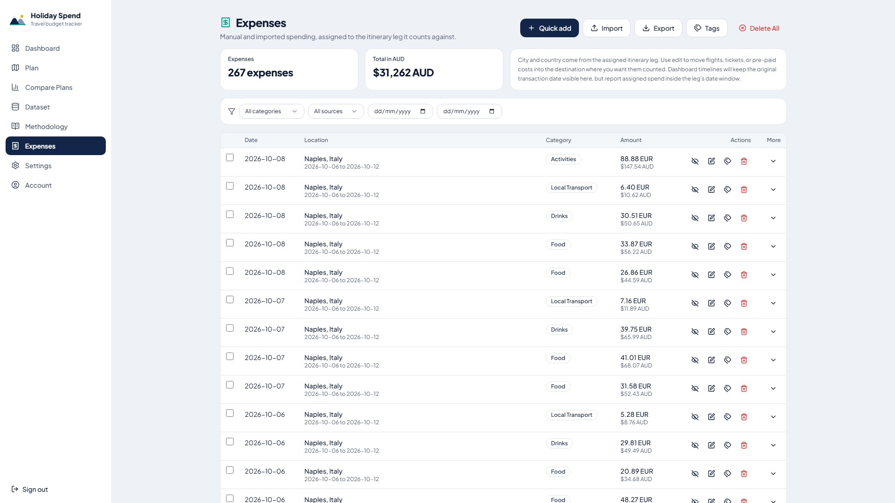
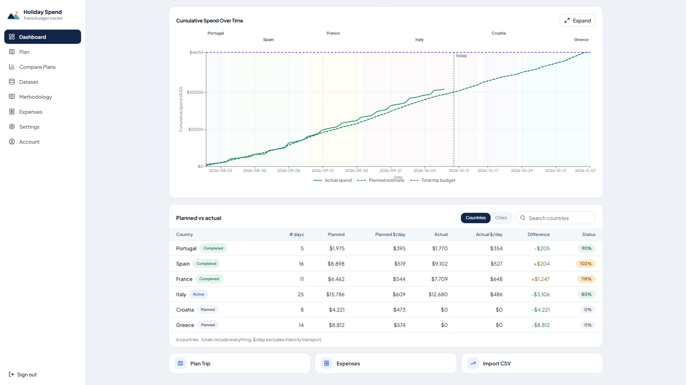
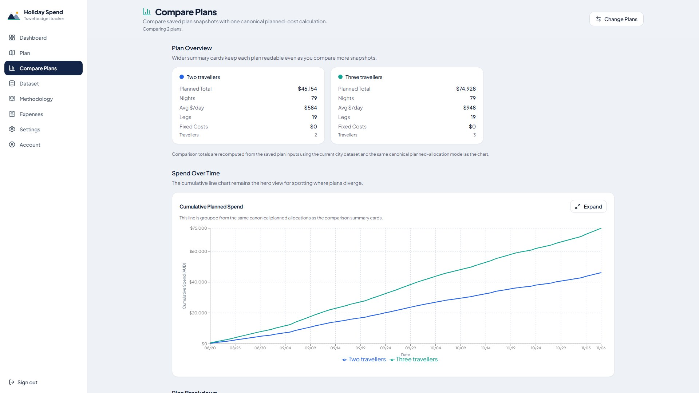
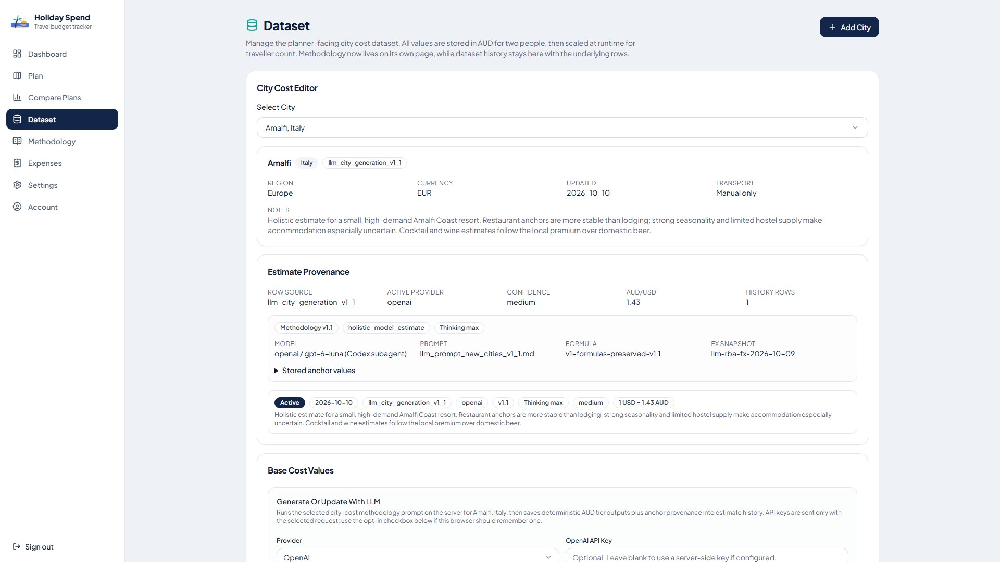
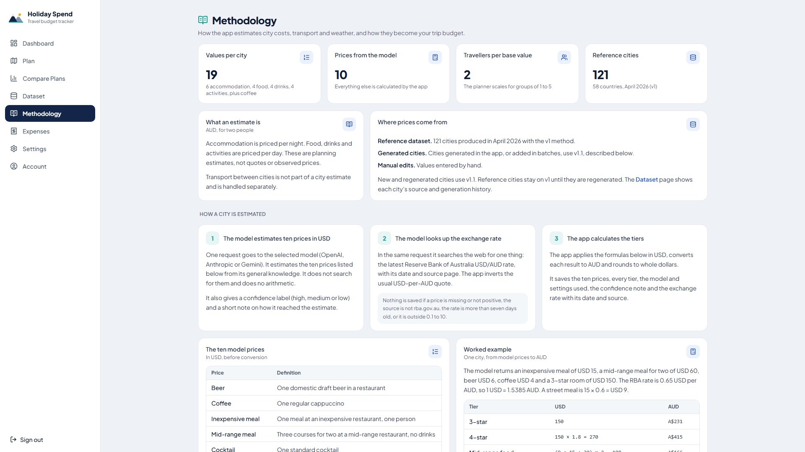

# Holiday Spend

A travel budget planner and spend tracker for long multi-city trips: months away, a dozen or more countries, and a
budget that has to hold up the whole way.



## Why it exists

Budgeting apps assume a fixed income and recurring bills. Trip planners assume two weeks in one place. Neither helps
when you are planning three months around the Mediterranean, or a year across four continents, and need to know
whether an extra week in one city means cutting one somewhere else.

Two things make that hard:

1. **Costs vary by city and by how you travel.** A night in Santorini is not a night in Zagreb, and a 3-star hotel is
   not a hostel dorm. You need per-city, per-tier numbers, not one daily average.
2. **Plans change while you travel.** You need to see how spending is tracking against the plan, by country and by
   category, and adjust as you go.

Holiday Spend handles both: plan the trip city by city before you leave, then track what you spend against it while
you are away.

## What it does

### Plan the trip leg by leg

Each leg is a city, dates, and a tier for accommodation, food, drinks and activities. City costs are stored for two
travellers and scaled for your group size, so changing the number of travellers re-costs the whole trip. Legs also
hold intercity transport and one-off costs, and any category can be overridden with a known price such as a booked
hotel.



Intercity transport can be entered by hand or estimated by a language model, which returns up to four options with
their sources. Nothing is added to the plan until you choose one.

### See the weather you will travel in

Every stay shows its typical temperature and rainfall for the month, from 2021 to 2025 historical averages. The trip
chart plots the whole journey day by day, so a cold or wet stretch is visible before you book it.



Destinations carry a freely licensed photo from Wikimedia Commons, credited to its author.

### Track what you actually spend

Log expenses by hand or import Wise CSV exports. Each expense is assigned to a leg, so spending lands in the right
city and country even when it was paid weeks earlier. Expenses can be tagged, excluded, reassigned and exported.



### Compare the plan with reality

The dashboard shows spending to date against the plan, your current destination and the next one, and planned
versus actual by country, city and category. The cumulative chart plots actual spending against the plan and the
total budget, banded by country, so overspending shows as a widening gap.



Saved plans can be compared side by side. Here the same trip is costed for two travellers and for three.



### Keep a library of city costs

The app ships with 121 cities. Any other city can be generated on demand, and every generated city records exactly
how its numbers were produced.



## How city costs are estimated

Each city has 19 values in AUD for two people: six accommodation tiers per night, and four tiers each for food,
drinks and activities per day.

To add a city, the app makes one request to a language model (OpenAI, Anthropic or Gemini):

1. The model estimates ten prices in USD from its general knowledge: a beer, a coffee, two restaurant meals, a
   cocktail, a glass of wine, a hostel bed, a hostel private room, and 1-star and 3-star hotel rooms.
2. In the same request it looks up the latest Reserve Bank of Australia exchange rate, with its date and source.
3. The app checks the response, applies fixed formulas to turn the ten prices into the 19 tiers, and converts them
   to AUD. The model does no arithmetic.

Everything used is saved with the city: the ten prices, the model and settings, the prompt and formula versions, the
exchange rate and its date, and the model's own confidence note. The estimates are model judgements, not observed
prices, and the app labels them that way.



The full method, including its limitations and the more elaborate approaches that were tried and set aside, is in
[docs/product/city-cost-methodology.md](docs/product/city-cost-methodology.md) and on the app's Methodology page.

## Built with

Next.js 14 (App Router) · TypeScript · Tailwind · Radix/shadcn · SQLite with Drizzle ORM and `better-sqlite3` · Zod ·
Recharts · NextAuth · Vitest and Playwright. Weather comes from Open-Meteo and photos from Wikimedia Commons; neither
needs a key.

It is a single Next.js app with a SQLite file on disk, which keeps it simple to run and back up for one household.
Language-model API keys are entered in the browser and never reach the repository, the database or the logs.

## Running it locally

```bash
npm ci
cp .env.example .env.local     # then set NEXTAUTH_SECRET and AUTH_DEV_PIN
npm run db:seed                # loads the 121-city cost dataset
```

Then either:

```bash
npm run dev                    # for changing code
npm run serve                  # for using the app (builds, then starts)
```

Use `npm run serve` to use the app. Development mode serves unminified bundles, about 14 MB of JavaScript for the
dashboard against 263 kB in a production build. The two use separate build directories (`.next-dev` and `.next`) so
they do not overwrite each other.

In development, sign in with `AUTH_DEV_PIN`. A production build disables the PIN and needs an email and password;
`npm run auth:set-local-password` sets one for the local user.

### Checks

```bash
npx tsc --noEmit
npm run build
npm test -- --run
npm run docs:check-memory          # CLAUDE.md and AGENTS.md must stay identical
npm run methodology:v1.1:check     # formula, exchange-rate and dataset-integrity check
npm run performance:check          # route, payload and JavaScript-size budgets for a signed-in user
```

`performance:check` needs credentials: `WEBAPP_AUTH_EMAIL` and `WEBAPP_AUTH_PASSWORD` for a production build, or
`WEBAPP_AUTH_PIN` with `WEBAPP_REQUIRE_BUILD=false` for a dev server. Without them it fails rather than measuring the
sign-in page.

## Project structure

| Path | Contents |
| --- | --- |
| `src/app` | Pages and API routes |
| `src/components` | Planner, dashboard, expenses, city library and shared UI |
| `src/lib` | Cost calculation, imports, language-model clients, climate, photos and methodology code |
| `src/db` | Schema, database setup and seed script |
| `data/reference/` | The city cost dataset and retained methodology evidence |
| `docs/prompts/` | Versioned language-model prompts |
| `scripts/` | Build, validation and data tooling |

## Documentation

| File | Purpose |
| --- | --- |
| [docs/product/city-cost-methodology.md](docs/product/city-cost-methodology.md) | How city costs are estimated and turned into a budget |
| [docs/product/transport-estimation.md](docs/product/transport-estimation.md) | How intercity transport is estimated |
| [docs/product/trip-climate.md](docs/product/trip-climate.md) | Where the weather averages come from |
| [docs/product/city-images.md](docs/product/city-images.md) | How city photos are found and credited |
| [CLAUDE.md](CLAUDE.md) / [AGENTS.md](AGENTS.md) | Project memory: what the app is and how it works today |
| [PLAN.md](PLAN.md) | Current plan and milestone status |
| [LOG.md](LOG.md) | History: what was built, what was tried, and what the evidence showed |
| [docs/ops/deployment.md](docs/ops/deployment.md) | Deployment |
| [docs/README.md](docs/README.md) | Guide to everything else under `docs/` |

`LOG.md` records the approaches that were rejected as well as the ones that shipped. The city-cost method went
through several far more elaborate designs, built on collecting prices from the web, before the simpler one in use
now.

## Scope

This is a personal project for one household's travel, not a product with sign-ups. It is public because the
engineering may be of interest. The screenshots show a fictional demo trip, not real spending.
